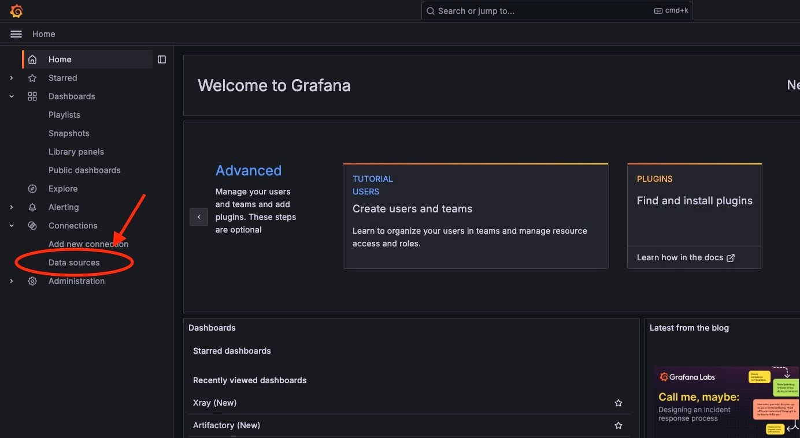
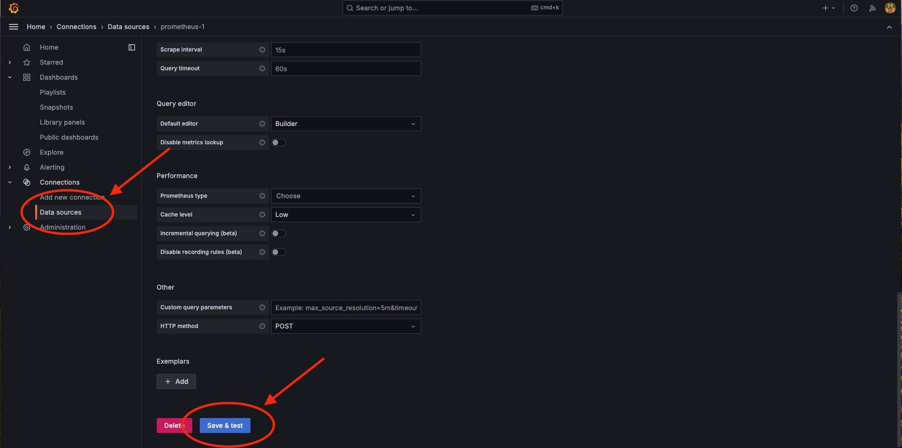
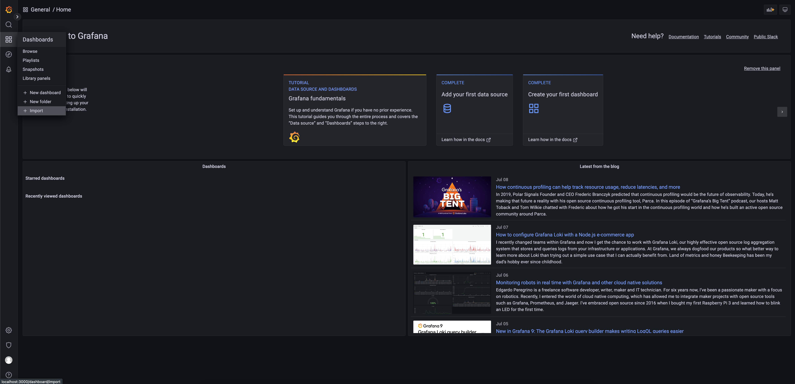
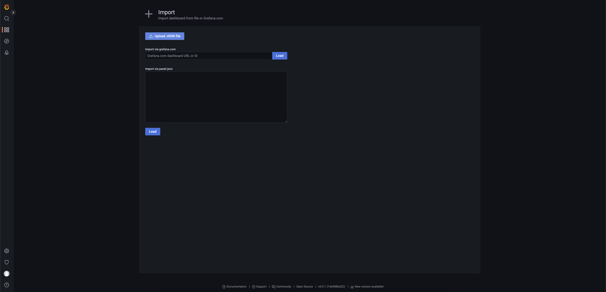

# Prometheus + Loki + Grafana based Log Analytics and Metrics for JFrog Artifactory, Xray

The JFrog Log Analytics and Metrics solution using Prometheus consists of three segments,

1. Prometheus - the component where metrics data gets ingested
2. Loki - the component where log data gets ingested
3. Grafana - the component where data visualization is achieved via prebuilt dashboards

## Pre-Requisites

1. Working and configured Kubernetes Cluster - Amazon EKS / Google GKE / Azure AKS / Docker Desktop / Minikube

   1. Recommended Kubernetes Version 1.25.2 and above
   2. For Google GKE, refer [GKE Guide](https://cloud.google.com/kubernetes-engine/docs/how-to)
   3. For Amazon EKS, refer [EKS Guide](https://docs.aws.amazon.com/eks/latest/userguide/getting-started.html)
   4. For Azure AKS, refer [AKS Guide](https://docs.microsoft.com/en-us/azure/aks/)
   5. For Docker Desktop and Kubernetes, refer [DOCKER Guide](https://docs.docker.com/desktop/kubernetes/)
2. 'kubectl' utility on the workstation which is capable of connecting to the Kubernetes cluster

   1. For Installation and usage refer [KUBECTL Guide](https://kubernetes.io/docs/tasks/tools/)
3. HELM v3 Installed

   1. For Installation and usage refer [HELM Guide](https://helm.sh/docs/intro/install/)
4. Versions supported and Tested:

   Jfrog Platform: 10.9.2

   Artifactory : 7.46.10

   Xray : 3.59.4

   Prometheus:2.39.1

   Grafana:9.2.3

   Loki: 2.6.1

## Read me before installing

### Important Note: This version replaces all previous implementations. This version is not an in-place upgrade to the existing solution from JFrog but is a full reinstall. Any dashboard customizations done on previous versions will need to be redone after this install.

```html
This guide assumes the implementer is performing new setup, Changes to handle install in an existing setup will be highlighted where applicable.
    if prometheus is already installed and configured, we recommend to have the existing prometheus release name handy.
    If Loki is already installed and configured, we recommend to have its service URL handy.
```

If Prometheus and Loki are already available you can skip the installation section and proceed to [Configuration Section](#Configuration).

# Installation

## Installing Prometheus, Loki and Grafana on Kubernetes

The Prometheus Community [kube-prometheus-stack](https://github.com/prometheus-community/helm-charts/tree/main/charts/kube-prometheus-stack) helm chart allows the creation of Prometheus instances and includes Grafana.
The Grafana Community [grafana](https://github.com/prometheus-community/helm-charts/tree/main/charts/kube-prometheus-stack) helm chart allows the creation of Loki instances and includes Grafana which can link to prometheus.

Once the Pre-Requisites are met, to install Prometheus Kubernetes stack:

#### Create the Namespace required for Prometheus Stack deployment

```bash
export INST_NAMESPACE=jfrog-plg
```

We will use `jfrog-plg` as the namespace throughout this document. That said, you can use a different or existing namespace instead by setting the above variable.

```bash
kubectl create namespace $INST_NAMESPACE
kubectl config set-context --current --namespace=$INST_NAMESPACE  
```

#### Install the Prometheus chart

Note: This installation comes with a Grafana installation

Add the required Helm Repositories:

```bash
helm repo add prometheus-community https://prometheus-community.github.io/helm-charts
helm repo update
```

Install the chart:

```bash
helm upgrade --install "prometheus" prometheus-community/kube-prometheus-stack -n $INST_NAMESPACE
```

```yaml
* "prometheus" here is the value that needs to be used against the value for "release_name" in the configuration section
```

For Docker Desktop, run this additional command to correct the mount path propagation for prometheus node-exporter component,
An error event will be appearing as follows "Error: failed to start container "node-exporter": Error response from daemon: path / is mounted on / but it is not a shared or slave mount"

```bash
kubectl patch ds prometheus-prometheus-node-exporter --type "json" -p '[{"op": "remove", "path" : "/spec/template/spec/containers/0/volumeMounts/2/mountPropagation"}]' -n $INST_NAMESPACE
```

#### Install the Loki chart

Add the required Helm Repositories:

```bash
helm repo add grafana https://grafana.github.io/helm-charts
helm repo update
```

Install the chart:

```bash
helm upgrade --install "loki" --values helm/loki-values.yaml grafana/loki -n $INST_NAMESPACE
```

```yaml
* "loki" will be the service name, the url to access loki as a datasource can be visualised as http://<service_name>.<namespace>:<port>
      ex: http://loki.$INST_NAMESPACE:3100 will be the "loki_url" value

* version 2.9.3 is the most recent loki version at the time of writing the document
      if there is a need to deploy this exact version, change the version value in "--set loki.image.tag=my_desired_version" to your desired version.

```

## JFrog Platform + Metrics via Helm ⎈

Ensure Jfrog repo is added to helm.

```bash
helm repo add jfrog https://charts.jfrog.io
helm repo update
```

To configure and install JFrog Platform with Prometheus metrics being exposed use our file `helm/jfrog-platform-values.yaml` to expose a metrics and new service monitor to Prometheus.

JFrog Platform ⎈:

```bash
helm upgrade --install jfrog-platform jfrog/jfrog-platform \
       -f helm/jfrog-platform-values.yaml \
       -n $INST_NAMESPACE
```

**If you are installing in the same cluster with the deprecated solution, Use the same namespace as the previous one instead of jfrog-plg above.**

## Artifactory / Artifactory HA + Metrics via Helm ⎈

For configuring and installing Artifactory Pro/Pro-x use the `artifactory-values.yaml` file.

For configuring and installing Enterprise/Ent+ use the `artifactory-ha-values.yaml` file.

Before starting Artifactory or Artifactory HA installtion generate join and master keys for the installation:

```bash
export JOIN_KEY=$(openssl rand -hex 32)
export MASTER_KEY=$(openssl rand -hex 32)
```

Then helm install the Artifactory or Artifactory HA charts:

Artifactory ⎈:

helm install `artifactory` chart (using the above generated join and master keys). Note that you need to be at the root of this repository folder to have the helm values yaml available

```bash
helm upgrade --install artifactory jfrog/artifactory \
       --set artifactory.masterKey=$MASTER_KEY \
       --set artifactory.joinKey=$JOIN_KEY \
       -f helm/artifactory-values.yaml \
       -n $INST_NAMESPACE
```

**If you are installing in the same cluster with the deprecated solution, Use the same namespace as the previous one instead of jfrog-plg above.**

Artifactory-HA ⎈:

helm install `artifactory-ha` chart (using the above generated join and master keys). Note that you need to be at the root of this repository folder to have the helm values yaml available

```bash
helm upgrade --install artifactory-ha jfrog/artifactory-ha \
       --set artifactory.masterKey=$MASTER_KEY \
       --set artifactory.joinKey=$JOIN_KEY \
       -f helm/artifactory-ha-values.yaml \
       -n $INST_NAMESPACE
```

**If you are installing in the same cluster with the deprecated solution, Use the same namespace as the previous one instead of jfrog-plg above.**
Note the above examples are only references you will need additional parameters to configure TLS, binary blob storage, or other common Artifactory features.

This will complete the necessary configuration for Artifactory and expose a new service monitor `servicemonitor-artifactory` to expose metrics to Prometheus.

## Xray + Metrics via Helm ⎈

To configure and install Xray with Prometheus metrics being exposed use our file `helm/xray-values.yaml` to expose a metrics and new service monitor to Prometheus.

Xray ⎈:

Generate master keys for the Xray installation:

````bash
export XRAY_MASTER_KEY=$(openssl rand -hex 32)
````

Use the same `JOIN_KEY` from the Artifactory installation, in order to connect Xray to Artifactory. Note, that you need to be at the root of this repository folder to have the `helm/xray-values.yaml` available

```bash
# getting Artifactory URL
export RT_SERVICE_IP=$(kubectl get svc -n $INST_NAMESPACE artifactory-artifactory-nginx -o jsonpath='{.status.loadBalancer.ingress[0].ip}')

# helm install xray
helm upgrade --install xray jfrog/xray --set xray.jfrogUrl=http://$RT_SERVICE_IP \
       --set xray.masterKey=$XRAY_MASTER_KEY \
       --set xray.joinKey=$JOIN_KEY \
       --set xray.openMetrics.enabled=true \
       --set xray.metrics.enabled=true \
       -f helm/xray-values.yaml \
       -n $INST_NAMESPACE
```

**If you are installing in the same cluster with the deprecated solution, Use the same namespace as the previous one instead of jfrog-plg above.**

## To Assess the setup for Prometheus

Use 'kubectl port forward' as mentioned below in a separate terminal window

```bash
   kubectl port-forward service/prometheus-operated 9090:9090 -n $INST_NAMESPACE
```

Go to the web UI of the Prometheus instance "http://localhost:9090" and verify "Status -> Service Discovery", the list shows the new ServiceMonitor for Artifactory or Xray or both, as shown here:

```plaintext
Deafult user/password for Prometheus is -> UNAME/PASSWD
```

## To Assess the setup for Grafana

use 'kubectl port forward' as mentioned below in a separate terminal window

```bash
   kubectl port-forward service/prometheus-grafana 3000:80 -n $INST_NAMESPACE

```

1. Open your Grafana on a browser at "http://localhost:3000" (grafana default credentials are "admin" / "prom-operator").
2. Go to "Configuratoin" -> "Data Sources" on the left menu:

   
3. Add your Prometheus instance and Loki Instance as datasources:

   * When adding Loki data source, specify url value as `http://loki:3100`
   * Prometheus data dource might be added from config automatically. If not, add Prometheus data dource and specify url value as `http://prometheus-kube-prometheus-prometheus:9090/`
     
4. While specifying datasource url for `Loki` and `Prometheus`, please test and confirm that the connection is successful using the `Save & Test` button at the bottom of the adding data source page:

   

   After adding both `Loki` and `Prometheus` Data Sources your "Configuration" -> "Data Sources" page should look like the following:
   

## Grafana Dashboard

Example dashboards are included in the [grafana directory](grafana). These dashboards needs to be imported to the grafana. These include:

- Artifactory Metrics and Log Analytics Dashboard [Download Here](grafana/ArtifactoryLogAnalyticsAndSystemMetrics.json)
- Xray Metrics and Log Analytics Dashboard [Download Here](grafana/XrayLogAnalyticsAndSystemMetrics.json)

After downlowding the dashboards go to "Dashboards" -> "Import":



Pick `Uplaod JSON file` and upload Artifactory and Xray dashboards files that you downloaded in the previous step.

Import the Dashboards and select the appropriate sources



## References

* [Grafana Dashboards](https://grafana.com/docs/grafana/latest/features/dashboard/dashboards/)
* [Grafana Queries](https://prometheus.io/docs/prometheus/latest/querying/basics/)
* [Loki Queries](https://grafana.com/docs/loki/latest/logql/)
